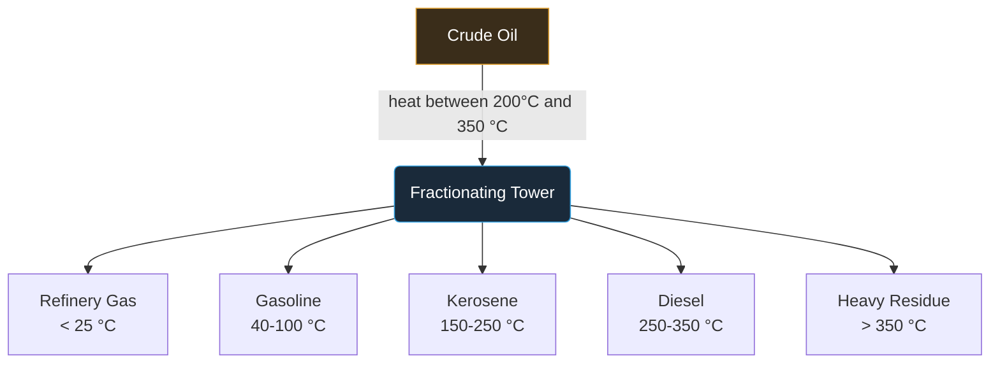

---
tags:
  - satisfactory
  - mod
  - distillation
  - docs
title: Raz Fractional Distillation
In Editor Class:
---

# 🛢️ Raz Fractional Distillation

> A showcase mod to prove to myself I'm not a complete moron

---

> [!NOTE]- This Mod is WIP
> This mod is still in progress and is subject to change in both scope and plan.
> It was originally planned to have 6 alternate recipes for the basic items, plastic and rubber,
> over time fuel was added and the scope was reduced to 4 "tiers", one being the main recipe
> and the other 3 being alternate recipes.

> [!TIP]- Interlinking of Processing is Recommended
> Its best to link your plastic, rubber and fuel chains together for better efficiency.
> Sulphur for example is a good reference when looking at slight efficient boosts 
> for handling a single belt, plan ahead!

> [!WARNING]- Focus on Stable Power
> The starting power requirements can be quite high, try to start with a fuel focus, 
> quickly processing liquid fuels using alternate recipes
 
---

## Fractional Heating

> [!NOTE] Outline of Fractional Distillation
> Shrinking the difference between the heat added to the system and the maximum required temperature
> causes products to drop in or out of production, for example extreme heat will cause refinery gas
> to be lost and gasoline to need cooling before use

> [!TIP]- Heavy Residue Focus
> Focus on "Heavy Residue" early, turning the temperature high, this can be done be increasing the overclock on the machine
> this produces large amounts quickly at the cost of useful products, in return the residue can form fuels and burn energy positive.
> As energy is scarce when working with refinery chains, its important to focus on power early in the production chain

---

## Recipe / Fraction Table

| Fraction        | Boiling range | Tower height | Output / min | Use                |
| --------------- | ------------- | :----------: | -----------: | ------------------ |
| Refinery Gas    | `< 25 °C`     | Top          |          120 | Fuel, plastics     |
| Gasoline        | `40-100 °C`   | Upper        |           80 | Vehicle fuel       |
| Kerosene        | `150-250 °C`  | Middle       |           60 | Jet fuel, lamps    |
| Diesel          | `250-350 °C`  | Lower        |           45 | Heavy machinery    |
| Heavy Residue   | `> 350 °C`    | Bottom       |           30 | Bitumen, lubricant |

---

> [!SUCCESS] That's the tour done, try out **[the recipe tree for more details](Recipe-Tree.md)**
