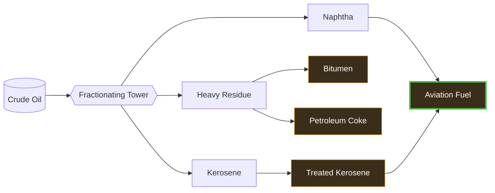

---
tags:
  - satisfactory
  - mod
  - recipes
  - fuels
title: Fuel Ladder - T1 to T4
In Editor Class:
---

# ⛽ Fuel Ladder

> [!INFO] Fuel progression
> Four tiers of fuel refined out of crude oil with optional high efficiency routes.
> Each tier burns cleaner and packs more energy than the last, added to the
> correct fuel generator for a huge amount of power from oil!

---

## The ladder at a glance

>[!tip] Treated Kerosene is only a little better than Coke due to the cost of making the fuel

|  Tier  | Fuel             | Made from                  |    Energy    |
| :----: | ---------------- | -------------------------- | :----------: |
| **T1** | Bitumen          | Heavy Residue              | ★☆☆☆☆ 12 MW  |
| **T2** | Petroleum Coke   | Heavy Residue              | ★★☆☆☆ 30 MW  |
| **T3** | Treated Kerosene | Kerosene + refining        | ★★★☆☆ 72 MW  |
| **T4** | Advanced Fuel    | Naphtha + Treated Kerosene | ★★★★★ 145 MW |

$$Power, \ {MW} = \dfrac{Energy Density \times Rate}{60}$$

 ---
 

> [!TIP] Tier Skipping
> Skipping directly to T2 Coke is possible and can be advantageous,
> if you already have a strong power grid!
