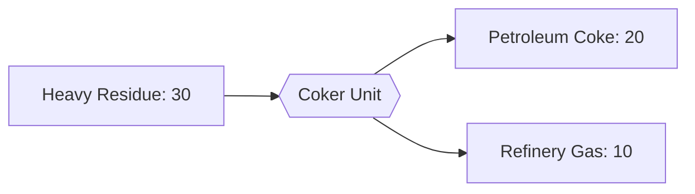

---
tags:
  - satisfactory
  - mod
  - recipes
  - fuels
  - tier2
title: Petroleum Coke - T2 Fuel
tier: 2
In Editor Class:
---

# ⬛ Petroleum Coke (T2)

> [!INFO] Tier 2 fuel
> Cook the residue hard enough and it cracks into near-pure solid carbon.
> Denser than bitumen and burns easier.

---

## Main recipe - Delayed Coking

| | Input | Output | Building | Time |
|---|---|---|---|---|
| **Main** | 30 Heavy Residue | 20 Petroleum Coke + 10 Refinery Gas | Coker Unit | 6 s |

> [!TIP] Byproduct bonus
> Coking releases light gas, pipe the Refinery Gas off to the plastics line or burn it in a flue stack.

---

## Alternate 1 - Bitumen Upgrading

Re-cook T1 bitumen into the better fuel. Lets you "promote" a stockpile.

| Input      | Output            | Building   | Time |
| ---------- | ----------------- | ---------- | ---- |
| 30 Bitumen | 15 Petroleum Coke | Coker Unit | 8 s  |

---

## Alternate 2 - Co-Feed Coking

Add diesel to the feed for a higher coke yield per cycle.

| Input                        | Output            | Building   | Time |
| ---------------------------- | ----------------- | ---------- | ---- |
| 20 Heavy Residue + 15 Diesel | 40 Petroleum Coke | Coker Unit | 8 s  |

---

> [!SUCCESS] Next tier: **[Treated Kerosene (T3)](03-Kerosene.md)**
