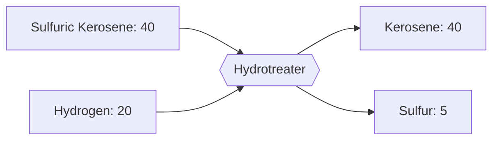

---
tags:
  - satisfactory
  - mod
  - recipes
  - fuels
  - tier3
title: Treated Kerosene - T3 Fuel
tier: 3
In Editor Class:
---

# 🟡 Kerosene  (T3)

> [!INFO] Tier 3 fuel
> Raw kerosene, hydrotreated to strip sulphur and clean up the burn.
> One easy refining step for reliable mid-grade fuel

---

## Main recipe - Hydrotreating

|          | Input                              | Output                 | Building     | Time |
| -------- | ---------------------------------- | ---------------------- | ------------ | ---- |
| **Main** | 40 Sulfuric Kerosene + 20 Hydrogen | 40 Kerosene + 5 Sulfur | Hydrotreater | 4 s  |

> [!TIP] Sulphur is optional waste
> Hydrotreating spits out sulphur as a by-product. You're never *required* to use it,
> sink it, or feed it to the rubber line's optional sulphur-cure recipes for a bonus.

---

## Alternate 1 - Caustic Wash *(no hydrogen)*

Clean kerosene without hydrogen!

>[!Warning] Lossy Production
>A higher time to create and wastage can cripple a power grid,
>compared to cracking refinery gases into hydrogen in a single step, its a bad choice

| Input                  | Output      | Building     | Time |
| ---------------------- | ----------- | ------------ | ---- |
| 40 Kerosene + 10 Water | 30 Kerosene | Hydrotreater | 6 s  |

---

## Alternate 2 - Diesel Cracking

Crack heavier diesel down into the kerosene range, then treat it.

| Input                   | Output      | Building     | Time |
| ----------------------- | ----------- | ------------ | ---- |
| 30 Diesel + 15 Hydrogen | 45 Kerosene | Hydrotreater | 6 s  |

---

> [!SUCCESS] Next tier: **[Aviation Fuel (T4)](04-Advanced-Fuel.md)**
