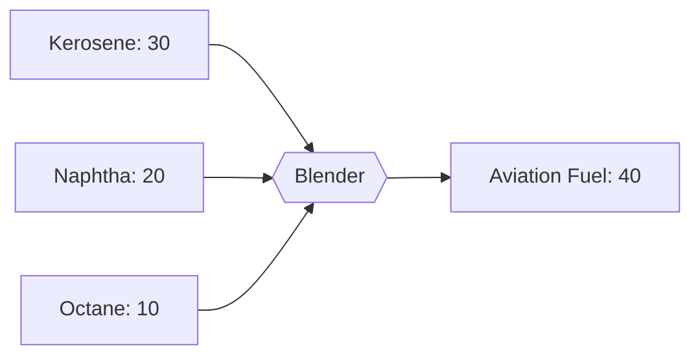

---
tags:
  - satisfactory
  - mod
  - recipes
  - fuels
  - tier4
title: Advanced Fuel - T4 Fuel
tier: 4
In Editor Class:
---

# ✈️ Advanced Fuel (T4)

> [!INFO] Tier 4 fuel
> Light **Naphtha** blended with clean **Kerosene**, second highest energy density, cleanest burn,

---

## Main recipe - Aviation Blending

|          | Input                                | Output           | Building | Time |
| -------- | ------------------------------------ | ---------------- | -------- | ---- |
| **Main** | 30 Kerosene + 20 Naphtha + 10 Octane | 40 Advanced Fuel | Blender  | 2 s  |

---

## Alternate 1 - High-Octane Blend

>[!Warning] Octane hungry!

| Input                   | Output           | Building | Time |
| ----------------------- | ---------------- | -------- | ---- |
| 30 Kerosene + 40 Octane | 45 Advanced Fuel | Blender  | 6 s  |

---

## Alternate 2 - Raw Blend

Skip the treating step and blend raw kerosene with an additive. More volume, lower quality.

| Input                             | Output           | Building | Time |
| --------------------------------- | ---------------- | -------- | ---- |
| 30 Sulfuric Kerosene + 15 Naphtha | 15 Advanced Fuel | Blender  | 10 s |

> [!WARNING] Quality trade-off
> Although large amounts of work can be circumvented, its usually not the smartest idea!

---

> [!SUCCESS] End of the fuel line
> ↩ Back to the **[Recipe Tree](../Recipe-Tree.md)**.
