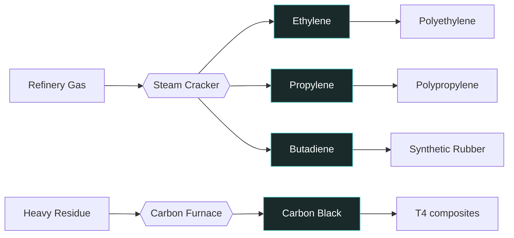

---
tags:
  - satisfactory
  - mod
  - recipes
  - intermediates
title: Cracking Intermediates
In Editor Class:
---

# 🧪 Cracking Intermediates

> [!INFO] The building blocks
> These aren't fuels or final goods — they're the **monomers and fillers** the
> plastic and rubber lines are built from. Most come from cracking refinery gas;
> carbon black comes off the heavy-residue line.

---

## Feedstock

| Intermediate                         | Feeds                                          |
| ------------------------------------ | ---------------------------------------------- |
| [Ethylene](./01-Ethylene.md)         | Polyethylene (T2 plastic)                      |
| [Propylene](./02-Propylene.md)       | Polypropylene (T3 plastic)                     |
| [Butadiene](./03-Butadiene.md)       | Synthetic Rubber (T2 rubber)                   |
| [Carbon Black](./04-Carbon-Black.md) | Composite Polymer + Reinforced Elastomer (T4s) |

---

## Material Cracking

> [!TIP] One cracker, three monomers
> A steam cracker naturally yields ethylene, propylene, and butadiene together -
> so the "co-crack" alternates produce more than one at once, 
> the cracker can use water for a reduced rate or steam for a heightened rate.
