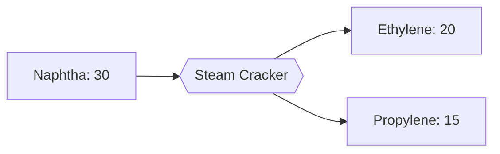

---
tags:
  - satisfactory
  - mod
  - recipes
  - intermediates
title: Ethylene
In Editor Class:
---

# 🧪 Ethylene

> [!INFO] Monomer
> The lightest cracking product and the feedstock for polyethylene (T2 plastic).

---

## Main recipe - Gas Cracking

|          | Input           | Output      | Building      | Time |
| -------- | --------------- | ----------- | ------------- | ---- |
| **Main** | 60 Refinery Gas | 40 Ethylene | Steam Cracker | 5 s  |

---

## Alternate 1 - Naphtha Co-Crack

Crack naphtha for ethylene **and** propylene at once.

| Input | Output | Building | Time |
|---|---|---|---|
| 30 Naphtha | 20 Ethylene + 15 Propylene | Steam Cracker | 6 s |

---

## Alternate 2 - High-Severity Crack

Run the cracker hotter for a higher ethylene yield, less of everything else.

| Input                      | Output      | Building      | Time |
| -------------------------- | ----------- | ------------- | ---- |
| 50 Refinery Gas + 10 Water | 45 Ethylene | Steam Cracker | 6 s  |

---