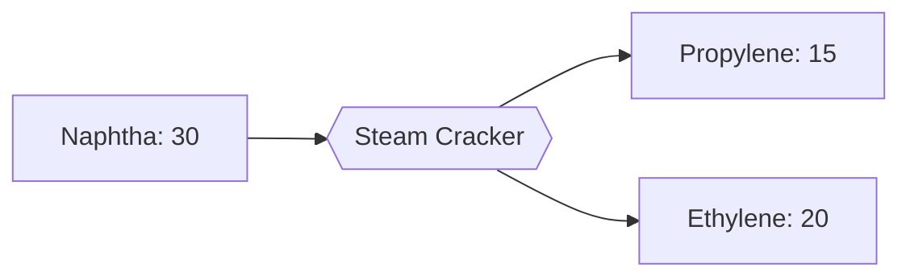

---
tags:
  - satisfactory
  - mod
  - recipes
  - intermediates
title: Propylene
In Editor Class:
---

# 🧪 Propylene

> [!INFO] Monomer
> A heavier cracking product, feedstock for polypropylene

---

## Main recipe - Gas Cracking

| | Input | Output | Building | Time |
|---|---|---|---|---|
| **Main** | 40 Refinery Gas | 25 Propylene | Steam Cracker | 4 s |

---

## Alternate 1 - Naphtha Co-Crack

| Input | Output | Building | Time |
|---|---|---|---|
| 30 Naphtha | 15 Propylene + 20 Ethylene | Steam Cracker | 6 s |

---

## Alternate 2 - Diesel Cracking

Crack a heavier cut for a propylene-rich output.

| Input     | Output       | Building      | Time |
| --------- | ------------ | ------------- | ---- |
| 30 Diesel | 30 Propylene | Steam Cracker | 8 s  |

---