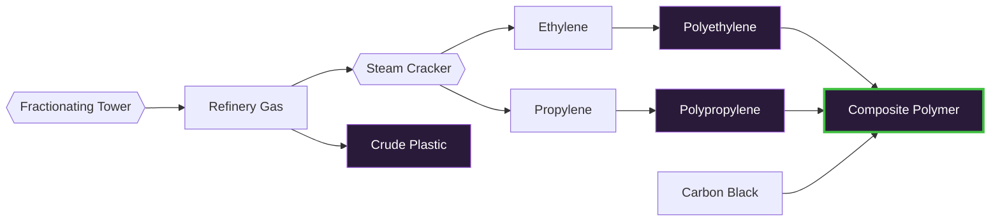

---
tags:
  - satisfactory
  - mod
  - recipes
  - plastics
title: Plastic Ladder - T1 → T4
In Editor Class:
---

# 🧱 Plastic Ladder

> [!INFO] The plastic progression
> Four tiers of plastic, from a brittle crude polymer up to an engineered composite.

---

## The ladder at a glance

|  Tier  | Plastic                                        | Made from              | Quality |
| :----: | ---------------------------------------------- | ---------------------- | :-----: |
| **T1** | [Crude Plastic](./01-Crude-Plastic.md)         | Refinery Gas           |  ★☆☆☆☆ (10/m) |
| **T2** | [Polyethylene](./02-Polyethylene.md)           | Ethylene               |  ★★☆☆☆ (20/m) |
| **T3** | [Polypropylene](./03-Polypropylene.md)         | Propylene              |  ★★★☆☆ (60/m) |
| **T4** | [Composite Polymer](./04-Composite-Polymer.md) | PE + PP + Carbon Black |  ★★★★★ (120/m) |

---

## How they connect

> [!TIP] Shared backbone
> Everything starts at **Refinery Gas**. T1 polymerizes it crudely; 
> T2-T3 crack it into cleaner monomers first.
> T4 reinforces them with **Carbon Black** from the heavy-residue line.
