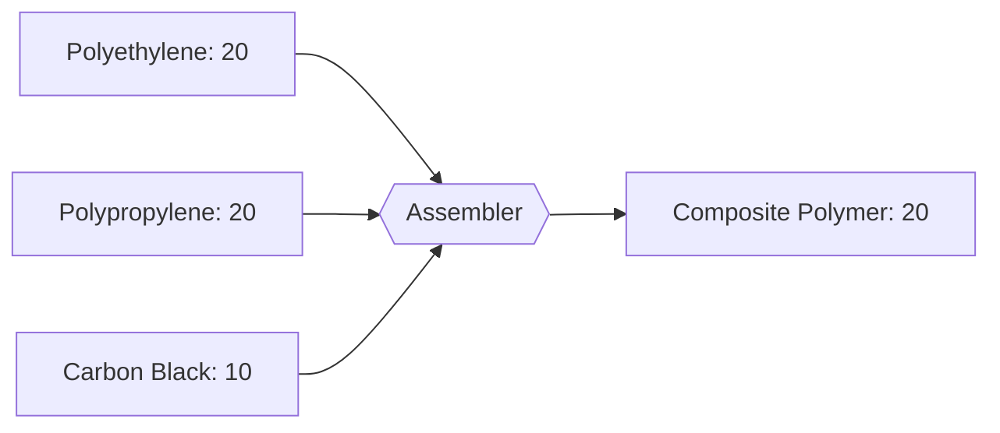

---
tags:
  - satisfactory
  - mod
  - recipes
  - plastics
  - tier4
title: Composite Polymer - T4
tier: 4
In Editor Class:
---

# ⬛🟪 Composite Polymer (T4)

> [!INFO] Tier 4 plastic
> Polyethylene and polypropylene reinforced with carbon black. 
> Stiff, strong, allows production of higher tier modular frames for cheap

---

## Main recipe - Composite Lamination

|          | Input                                                | Output               | Building  | Time |
| -------- | ---------------------------------------------------- | -------------------- | --------- | ---- |
| **Main** | 20 Polyethylene + 20 Polypropylene + 10 Carbon Black | 10 Composite Polymer | Assembler | 4 s  |

---

## Alternate 1 - Aramid Weave

Swap carbon black for aromatics to make a lighter, fibre-reinforced.

| Input                           | Output               | Building  | Time |
| ------------------------------- | -------------------- | --------- | ---- |
| 20 Polypropylene + 15 Aromatics | 10 Composite Polymer | Assembler | 20 s |

---

## Alternate 2 - Filled Composite

Stretch the polymer with bitumen filler - more volume, lower grade.

| Input                                          | Output              | Building | Time |
| ---------------------------------------------- | ------------------- | -------- | ---- |
| 20 Polyethylene + 10 Carbon Black + 10 Bitumen | 2 Composite Polymer | Blender  | 10 s |

> [!WARNING] Quality trade-off
> Filled Composite has weak points leading to less output than other recipes,
> it is recommended to use Aramid Weave as soon as possible, only switching to the main
> recipe if the time difference matters

---

> [!SUCCESS] Top of the plastics line
> ↩ Back to the **[Recipe Tree](../Recipe-Tree.md)**.
