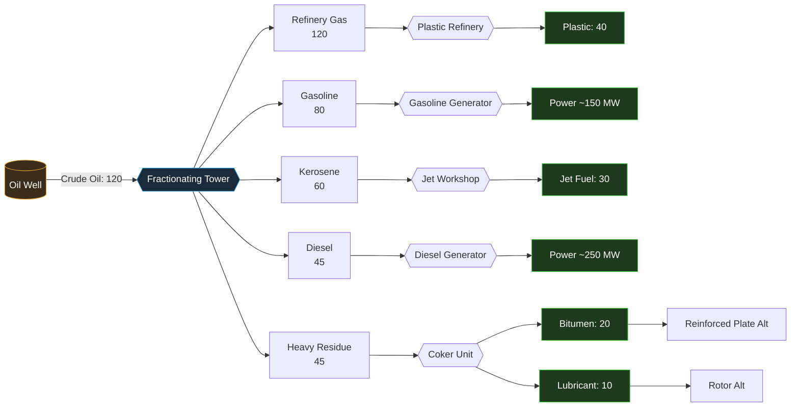
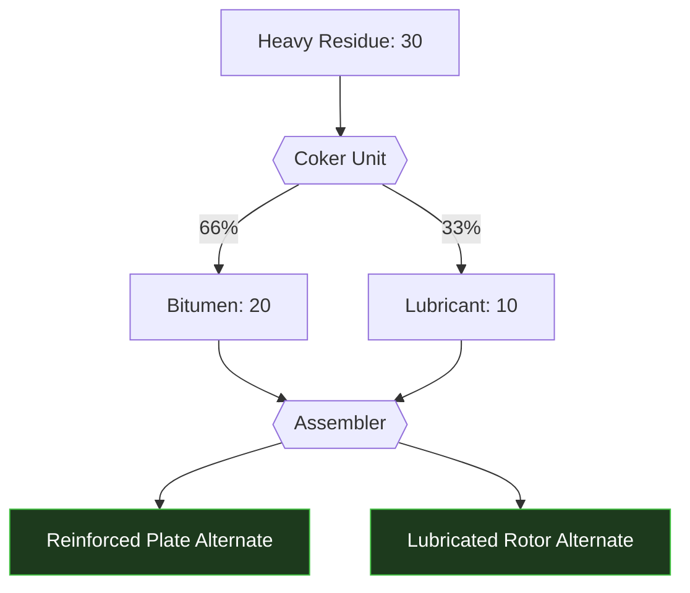

---
tags:
  - satisfactory
  - mod
  - recipes
  - distillation
title: Recipe Tree - Crude Oil Fractional Distillation
In Editor Class:
---

# Fractional Distillation

> [!INFO] Prepare for oil and oil derivatives
> The full production web for the mod, starting with the fractional distillation of oil.

> [!WARNING]- Power Changes and Local Maximums 
> Power Values are not final and are subject to rebalancing.
> Values listed on the diagram are highest throughput recipes, see Tower Focuses below for details

> [!TIP]- Rotor Alternate Recipe
> Massively improved rotor production speed and greater efficiency.

> [!TIP]- Reinforced Plate Alternate Recipe
>Although using higher throughputs of iron, mixing with bags of bitumen increases the speed
>greatly, improving the output by four times whilst keeping the same iron to plate ratio.

---

| Fraction        | Tower height | Rate /min | Primary downstream | Final product   |
| --------------- | :----------: | --------: | ------------------ | --------------- |
| Refinery Gas    | Top          |       120 | Plastic Refinery   | Plastic         |
| Gasoline        | Upper        |        80 | Gasoline Generator | Power           |
| Kerosene        | Middle       |        60 | Jet Workshop       | Jet Fuel        |
| Diesel          | Lower        |        45 | Diesel Generator   | Power           |
| Heavy Residue   | Bottom       |        30 | Coker Unit         | Bitumen + Lube  |

---

# Heavy Residue with the Coker

---

## Tower Focuses

> [!TIP] Temperature Ranges
> | Temp | Focus | Input | Outputs | Time |
> | ------------------------------- | ----------------------- | ------------- | ---------------------------------------------- | ---: |
> | Extreme Temp (~400 °C) | Heavy Residue / Bitumen | 30 Crude Oil  | Only 45 Residue   | 4 s |
> | High Temp (~350 °C)    | Diesel                  | 60 Crude Oil  | 45 Diesel No · Refinery Gas | 5 s |
> | Medium Temp (~250 °C)  | Kerosene                | 80 Crude Oil  | 60 Kerosene · No Residue               | 6 s |
> | Low Temp (~150 °C)     | Gasoline                | 100 Crude Oil | 80 Gasoline · 60 Refinery Gas              | 7 s |
> | Minimal Temp (~50 °C)  | Refinery Gas            | 120 Crude Oil | Only 120 Refinery Gas              | 8 s |

---

> [!SUCCESS] You should probably check out [Plastics](00-Plastic-Ladder.md)