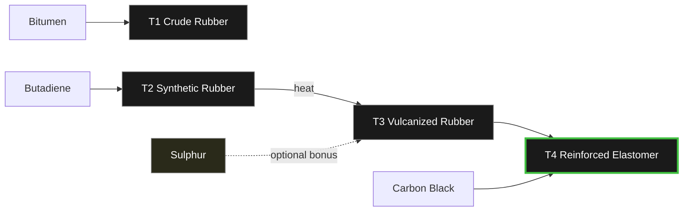

---
tags:
  - satisfactory
  - mod
  - recipes
  - rubber
title: Rubber Ladder - T1 → T4
In Editor Class:
---

# ⚫ Rubber Ladder

> [!INFO] The rubber progression
> Four tiers of elastomer, from a cheap tarry rubber up to a carbon-reinforced
> industrial grade. Cured with heat, and reinforced with **Carbon Black** (from
> heavy residue). Surplus **Sulphur** from the fuel line is an *optional* bonus input.

---

## The ladder at a glance

|  Tier  | Rubber                                               | Made from                 | Quality |
| :----: | ---------------------------------------------------- | ------------------------- | :-----: |
| **T1** | [Crude Rubber](./01-Crude-Rubber.md)                 | Bitumen                   |  ★☆☆☆☆ (10/s) |
| **T2** | [Synthetic Rubber](./02-Synthetic-Rubber.md)         | Butadiene                 |  ★★☆☆☆ (20/s) |
| **T3** | [Vulcanized Rubber](./03-Vulcanized-Rubber.md)       | Synthetic Rubber + heat   |  ★★★☆☆ (40/s) |
| **T4** | [Reinforced Elastomer](./04-Reinforced-Elastomer.md) | Vulcanized + Carbon Black |  ★★★★★ (160/s) |

---

## How they connect

> [!TIP] Heat-cured, sulphur optional
> Vulcanizing is done with **heat and pressure** - no sulphur required. 
> If you have surplus sulphur from the fuel line, optional recipes let you use it for a yield/quality bonus.
