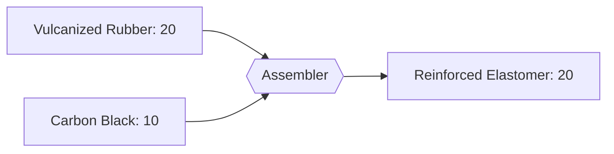

---
tags:
  - satisfactory
  - mod
  - recipes
  - rubber
  - tier4
title: Reinforced Elastomer - T4
tier: 4
In Editor Class:
---

# ⚫⬛ Reinforced Elastomer (T4)

> [!INFO] Tier 4 rubber
> Vulcanized rubber packed with carbon black - the industrial, tire-grade end of
> the line. Tough, abrasion-resistant, and the payoff of the whole rubber chain.

---

## Main recipe - Carbon Reinforcement

|          | Input                                  | Output                  | Building  | Time |
| -------- | -------------------------------------- | ----------------------- | --------- | ---- |
| **Main** | 20 Vulcanized Rubber + 10 Carbon Black | 10 Reinforced Elastomer | Assembler | 8 s  |

---

## Alternate 1 - Coke-Filled

Use ground petroleum coke as the carbon filler instead of carbon black.

| Input                                    | Output                 | Building  | Time |
| ---------------------------------------- | ---------------------- | --------- | ---- |
| 20 Vulcanized Rubber + 15 Petroleum Coke | 8 Reinforced Elastomer | Assembler | 8 s  |

---

## Alternate 2 - Oil-Resistant Grade

Add aromatics for a chemically-resistant elastomer (seals, gaskets).

| Input                                                | Output                  | Building  | Time |
| ---------------------------------------------------- | ----------------------- | --------- | ---- |
| 20 Vulcanized Rubber + 10 Carbon Black + 5 Aromatics | 12 Reinforced Elastomer | Assembler | 10 s |

---

> [!SUCCESS] Top of the rubber line
> ↩ Back to the **[Recipe Tree](../Recipe-Tree.md)**.
